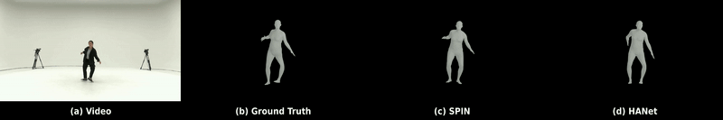

# HANet

## Description

Previous video-based human pose estimation methods have shown promising results by leveraging aggregated features of consecutive frames. However, most approaches compromise accuracy to mitigate jitter or do not sufficiently comprehend the temporal aspects of human motion. Furthermore, occlusion increases uncertainty between consecutive frames, which results in unsmooth results. To address these problems, we design an architecture that exploits the keypoints' kinematic features with the following components. First, we effectively capture the temporal features by leveraging individual keypoint's velocity and acceleration. Second, the proposed hierarchical transformer encoder aggregates spatio-temporal dependencies and refines the 2D or 3D input pose estimated from existing estimators. Finally, we provide an online cross-supervision between the refined input pose generated from the encoder and the final pose from our decoder to enable joint optimization. We demonstrate comprehensive results and validate the effectiveness of our model in various tasks: 2D pose estimation, 3D pose estimation, body mesh recovery, and sparsely annotated multi-human pose estimation.

## Getting Started

### Environment Requirement

HANet has been implemented and tested on Pytorch 1.10.1 with python = 3.6. It supports both GPU and CPU inference.

Clone the repo:

```bash
git clone https://github.com/wacv1686/HANet.git
```

We recommend you install the requirements using `conda`:

```bash
# conda
conda create env --name HANet python=3.6
pip install -r requirements.txt
```

### Prepare Data

We prepare all the datasets as soon as possible. Sub-JHMDB data used in our experiment can be downloaded here.

[Google Drive](https://drive.google.com/drive/folders/1uLpuRcRbbVqmyndCnuuaW7qRACJaqMX1?usp=sharing)

Valid data includes:

| Dataset                                  | Pose Estimator                                                               | 3D Pose | 2D Pose | SMPL |
| ---------------------------------------- | ---------------------------------------------------------------------------- | ------- | ------- | ---- |
| [Sub-JHMDB](http://jhmdb.is.tue.mpg.de/) | [SimpleBaseline](https://github.com/microsoft/human-pose-estimation.pytorch) |         | ✔       |      |

### Training

Note that the training and testing datasets should be downloaded and prepared before training.

Run the commands below to start training:

```shell script
python train.py --cfg [config file] --dataset_name [dataset name] --estimator [backbone estimator you use] --body_representation [smpl/3D/2D]
```

For example, you can train on **2D position representation** of the **jhmdb dataset** using the **backbone estimator simplebaseline** (sampling ratio=10%) by:

```shell script
python train.py --cfg configs/config_jhmdb_simplebaseline_2D.yaml --dataset_name jhmdb --estimator simplebaseline --body_representation 2D
```

### Evaluation

**Results on 2D Pose:**

| Dataset   | Estimator      | PCK 0.05 (Input/Output):arrow_up: | PCK 0.1 (Input/Output):arrow_up: | PCK 0.2 (Input/Output):arrow_up: | Checkpoint                                                                                           |
| --------- | -------------- | --------------------------------- | -------------------------------- | -------------------------------- | ---------------------------------------------------------------------------------------------------- |
| Sub-JHMDB | simplebaseline | 57.3%/88.7%                       | 81.6%/97.5%                      | 93.9%/99.5%                      | [Google Drive](https://drive.google.com/drive/folders/11A5NFkViDgQNyCGGwsmhAbUkwmV36M-E?usp=sharing) |

## Visualization

We prepare all visualization codes as soon as possible.

### 2D Pose

Sub-JHMDB SimpleBaseline, DeciWatch, HANet


### 3D Pose

AIST++ SPIN


### SMPL

3DPW PARE


AIST++ SPIN


